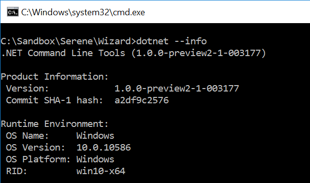
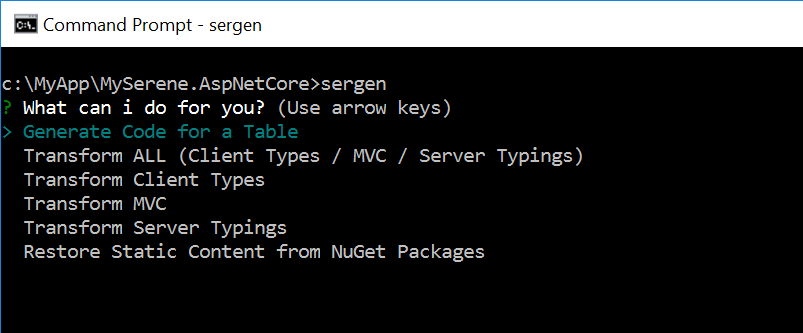
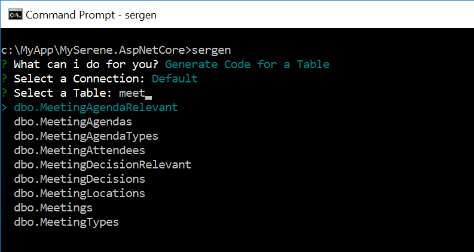
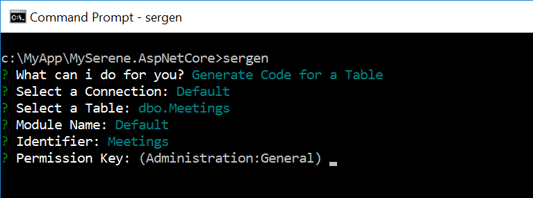
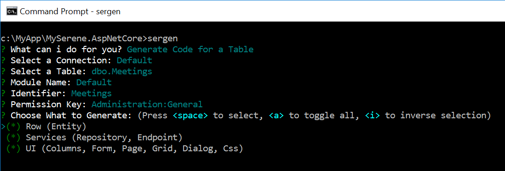

## Creating a New Serene Application for ASP.NET Core

Currently, you have two options (in addition to low level ones, like git clone etc.) for initializing a new ASP.NET Core
Serene project.

- From Visual Studio -> New -> Project -> Serene (Asp.Net Core)
- Using our new *Serin* package from NPM

Both options requires .NET Core SDK 1.1 and Node/NPM, so let's first make sure that they are installed.

### Check Node / NPM is Installed

Open a command prompt and type 

```cmd
> npm
```

to make sure that you have Node/NPM installed and is in your PATH.

If not, install it from [https://nodejs.org/en/download/](https://nodejs.org/en/download/) (LTS is recommended)

> The Node version that comes with Visual Studio is an old one and you might have problems.
Please install LTS release from above link.

### Check .NET Core 1.1 SDK is Installed

Open a command prompt and type 

```cmd
> dotnet --info
```



You must have version `1.0.0-preview2-1-003177`.

It is possible that you have multiple .NET Core SDK versions installed. 

Check that you have the folder `1.0.0-preview2-1-003177` under `C:\Program Files\dotnet\sdk`.

If not, please install .NET Core 1.1 SDK from:

https://www.microsoft.com/net/download/core

Make sure you select *Current* release and download .NET Core 1.1 SDK, not 1.0.3.

## Initializing a Serene ASP.NET Core Project Using Visual Studio

This option requires Visual Studio, and so is Windows only.

Serene template now comes with two separate templates.

* Serene (ASP.NET MVC)
* Serene (ASP.NET Core)

First one is our good old Serene that runs on full .NET framework 4.5 and ASP.Net MVC.

Second one is the new kid on the block that runs on .NET Core and ASP.NET MVC Core.

Just choose second one and create your application as usual. 

## Initializing a Serene ASP.NET Core Project Using SERIN (NPM)

This option is available in OSX / Linux / Windows with some help from our new NPM package *Serin*.

### Install Serin in Global Mode

Install our project initializer, *serin* as a global tool using NPM:

> I would like to code *Serin* in .NET Core too, but its CLI lacks automatic global 
package installation, way behind NPM feature wise, and has some bugs.

**Windows:**
```
> npm install -g serin
```

**Linux / OSX:**

```sh
> sudo npm install -g serin
```


> Thanks to Victor (@vctor) for Linux screenshots

### Create Folder for New Project

Create an empty *MySerene* (or a name you like) folder.

**Windows:**

```cmd
> cd c:\Projects
> mkdir MySerene
> cd MySerene
```

**Linux / OSX:**

```sh
> cd ~
> mkdir MySerene
> cd MySerene
```
.
> Serin has to be run from a completely empty directory

### Run Serin to Create a New Project

While inside an empty directory, run *serin*:

```cmd
> serin
```


Type an application name, e.g. *MySerene* and press enter. Take a break while Serin creates 
your project, initializates static content and restores packages etc.

After Serin creates your project, you will have a *MySerene.AspNetCore* folder under current directory. 
Enter that directory:

```cmd
> cd MyApp.AspNetCore
```

## Setting Connection String

ASP.Net Core doesn't have a web.config like an ASP.NET application. 
We have an *appsettings.json* file instead:

```
{
  "Data": {
    "Default": {
      "ConnectionString": "Server=(localdb)\\v11.0;Database=MyApp_Default_v1;Integrated Security=true",
      "ProviderName": "System.Data.SqlClient"
    },
    "Northwind": {
      "ConnectionString": "Server=(localdb)\\v11.0;Database=MyApp_Northwind_v1;Integrated Security=true",
      "ProviderName": "System.Data.SqlClient"
    }
  },
}
```

You should change these connection strings to a valid Sql Server instance.

If you are under OSX / Linux you can't use Windows Authentication so you have to switch to 
SQL Authentication. As Sql Server is Windows only, you'll need to use a remote server.

Currently, we only support Sql Server for runtime / code generation. 

See Serenity Guide for information on how to use *MySql* with Serene on .NET Core (no Sergen support yet). 

Other provider types are coming soon...

## Running Serene

If you are using Visual Studio, you can just rebuild and run your application 
(after setting connection strings).

For OSX / Linux, first restore packages:

```cmd
> dotnet restore
```

Make sure you run this command under *MySerene.AspNetCore* folder.

Then type:

```cmd
> dotnet run
```

Now open a browser and navigate to `http://localhost:5000`.

> Actual port may vary. You'll see it on console after executing *dotnet run*.

## Transforming templates

There are no T4 templates in Serene ASP.Net Core version.

*ClientTypes.tt*, *MVC.tt* and *ServerTypings.tt* are integrated into *Sergen* itself.

To transform *MVC*, e.g. view location helpers, make sure you are under *MySerene.AspNetCore* directory 
(the one that has *project.json* file) and run:

```cmd
dotnet sergen mvc
```

> You might also use `dotnet sergen m`

To transform *ClientTypes*, e.g. editor, formatter and other types:

```cmd
dotnet sergen clienttypes
```

> You might also use `dotnet sergen c`

To transform *ServerTypings*, e.g. rows, enums, services etc:

> Make sure your project runs before executing transform, as sergen uses your output DLL.

```cmd
dotnet sergen servertypings
```

> You might also use `dotnet sergen s`

It is also possible to run them ALL at ONCE:

```
dotnet sergen transform
```

> You might also use `dotnet sergen t`

## Restoring Static content

.NET Core projects doesn't support installing content files, e.g. scripts, css, fonts, images 
delivered via NuGet packages into *project.json* based ASP.NET Core projects, so we wrote
a workaround for you to use until we migrate all to NPM.

```cmd
dotnet sergen restore
```

> You might also use `dotnet sergen r`

This will enumerate referenced packages and restore static content from them into `wwwroot` folder.

*Serin* runs this automatically at project initialization, but in case you'll update NuGet 
packages later, you'll need to run this command again to restore static content from new packages.


## Generating Code

This one is tricky. `dotnet sergen` also has a `generate` command but unfortunately DOTNET CLI 
is very buggy at the moment and simple methods like *Console.ReadLine* and *Console.ReadKey* 
doesn't work properly for CLI tools like `dotnet-sergen`.

> Because it redirects standard input and output

So we had to workaround this by writing a Node version of Sergen just to PROMPT properly :(

Install Node version of Sergen by:

```
sudo npm install -g sergen
```

Now you can run *sergen*:

```cmd
> sergen
```



Here you can run other commands we saw before using arrow keys then ENTER. 
This will just delegate command to `dotnet sergen`.

You might also skip this first screen and run a command directly using *sergen*, e.g.:

```cmd
sergen mvc
sergen clienttypes
sergen servertypings
sergen restore
sergen generate
``` 

Or one letter versions:

```
sergen m
sergen c
sergen s
sergen r
sergen g
```

For example, `sergen mvc` will actually execute `dotnet sergen mvc`.

It becomes interesting only for *generate* command that is not working properly 
with *dotnet sergen* yet.

Let's choose first option (generate):


It'll ask us to choose a connection to generate code for.

After selecting a connection we are shown a list of tables:



You might select a table with arrow keys or if there are many tables, type some chars to search.

Next, it will ask you Module Name, Identifier and Permission Key. Type something you like, 
or press ENTER to accept defaults.



At least step, sergen will ask you what to generate:



You might generate all (recommended), or clear some boxes to skip generating some code.

After this, Sergen will generate code for your table as usual.

> There is no overwrite prompt or KDiff3 support yet, so before running Sergen, make sure you backup or 
use GIT. Otherwise you'll lose customizations you might had made before.

## Conclusion

I think, this will help you get up and running on .NET Core version. 

Even though Serene ASP.NET MVC and ASP.NET Core versions are kinda similar, there are parts 
where they differ much. We'll try to document them, and stabilize .NET Core version 
in following months.

You might also want to check .NET Core and ASP.Net Core docs (somewhat scarce) meanwhile.

I don't recommend ASP.NET Core version for production yet, as .NET Core itself is not so
stable and project system is undergoing many changes, e.g. switching from *project.json*
back to *msbuild and csproj* (rejoice?).