# Premium StartSharp Packages

Our premium packages are available at [http://serenity.is](http://serenity.is). Currently, four levels are offered: _Basic_, _Personal_, _Professional_ and _Enterprise_.

All support levels provide access to our *StartSharp* template, which includes additional samples, features, themes and modules (in addition to everything our free template *Serene*), that we'll talk about shortly. 

They also contain varying levels of premium support, except _Basic_ level which doesn't include support.

Let's first explain what you get with these premium packages.

## Commercial Licence

Serene Template and Serenity itself has a permissive MIT licence which allows usage in open source, commercial and proprietary applications.

*StartSharp* template comes with a commercial licence, that allows you to use it with any number of commercial applications / sites (except _Basic_ level which allows only one application)

> You are not allowed to use StartSharp content in an open source application as it would mean open sourcing StartSharp itself.

*StartSharp* is licenced per seat / developer. 

_Basic_ and _Personal_ levels comes with one licence, and allows just one developer to use StartSharp. These levels are only suitable for single / freelance developers.

You are allowed to use _Basic_ level licence for only one application / project. If you are planning to write multiple applications, you should consider _Personal_ or higher levels.   

_Professional_ level comes with 3 seats / developers licences, while _Enterprise_ contains 5 seats / developers licences. 

> Even though it is possible to buy multiple _Personal_ licences, we recommend _Professional_ or _Enterprise_ as they are more cost effective.

We also offer volume licencing discounts. Contact us at sales@serenity.is for more information.

## Private Support Desk

You get prioritized e-mail support from our core developers, with guaranteed initial response time of 72 / 48 / 24 hours (excluding weekends and public holidays) based on your support level.

> _Basic_ level doesn't contain any support.

This guranteed response time is for a certain number of issues (as a fair use policy) based on support level:

- _Personal_: 72 hours for first 10 Incidents
- _Professional_: 48 hours for first 15 Incidents
- _Enterprise_: 24 hours for first 20 Incidents

> This doesn't mean you won't receive an answer to your further incidents, response is just not guaranteed within specified time. 

> Initial response time specified excludes weekends and public holidays.

## Live Credits

These are hours that you can use to get direct remote support from our developers. 

We recommend using these credits for troubleshooting, so that you can save your precious hours / days by letting us handle the problem in a few minutes.

You may also use these hours for custom development, additional features etc.

It's also possible to buy additional hours, and our premium members get a discount over average fee.

_Basic_ and _Personal_ doesn't contain any live credits.

_Professional_ level comes with 3 hours of live credits, while _Enterprise_ has 5 hours.

## Access to Full Source Code

All levels except _Basic_, provides access to _StartSharp_ GitHub repository with full source code.

## Expiration and Renewals

The packages you buy provide access to StartSharp repository, updates and premium support for a period of 12 months (except _Basic_).

Once that period ends, we won't auto renew your subscription and you'll receive an e-mail from us with a discounted renewal offer (usually around 25%).

If you choose to not renew, you'll only lose access to source code, updates and premium support.

You'll be keeping your StartSharp licence and continue using versions of StartSharp released during your subscription period.

# StartSharp

*StartSharp* is premium version of our free *Serene* template. 

It includes everything that Serene has, in addition to extra samples, features and modules.

We're regularly adding extra content into *StartSharp*. 

> Some of these like *card view* are sponsored by our customers. We'd like to thank them for letting us to share with community.

Here is a list of what is currently available in StartSharp...

## Premium Themes

StartSharp contains 6 premium themes:

* Azure
* Azure Light
* Cosmos
* Cosmos Light
* Glassy
* Glassy Light

You might have a look at our new themes in our demo at http://serenity.is/demo

Here are some screenshots

### Azure Light (default theme for StartSharp)

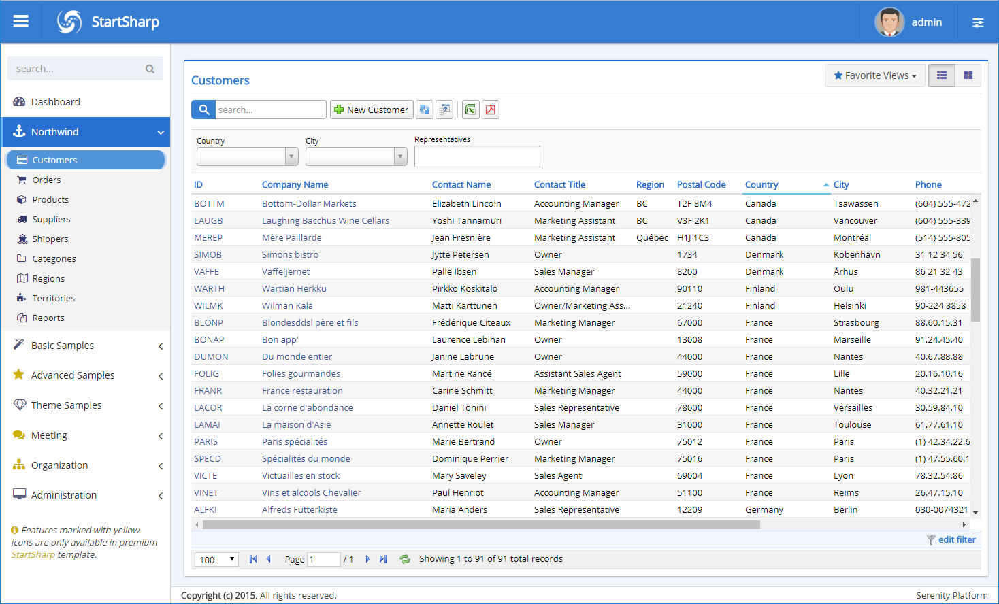

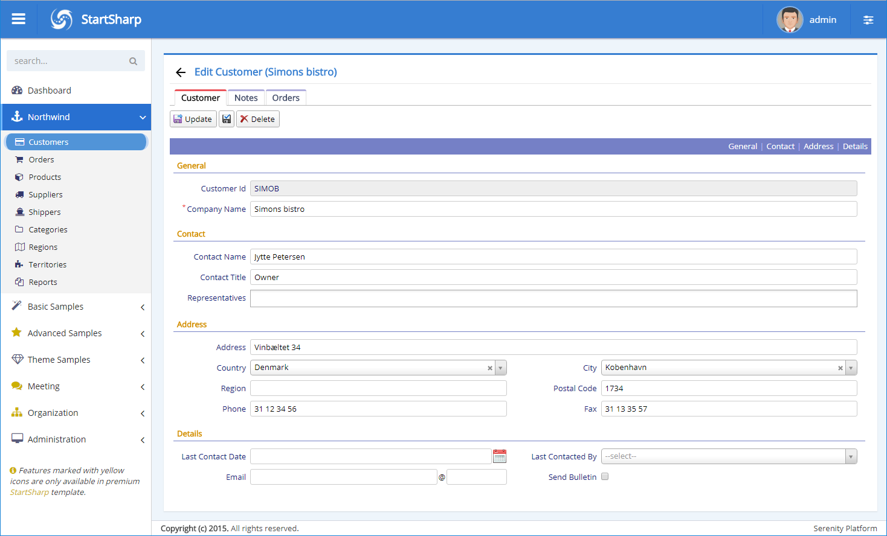

### Azure (dark sidebar)

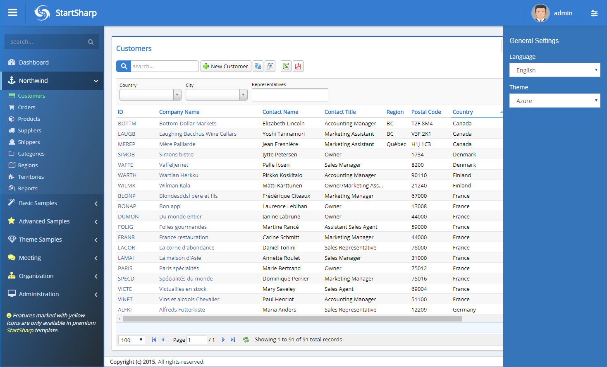

### Cosmos

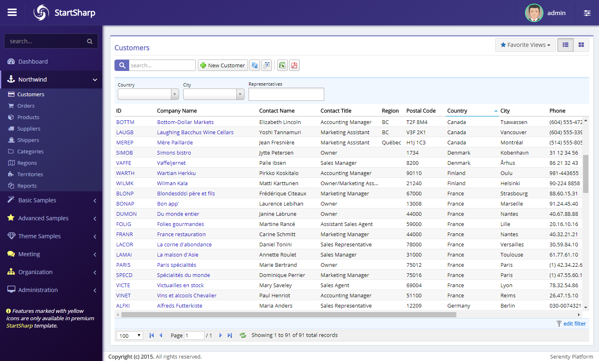

### Cosmos Light

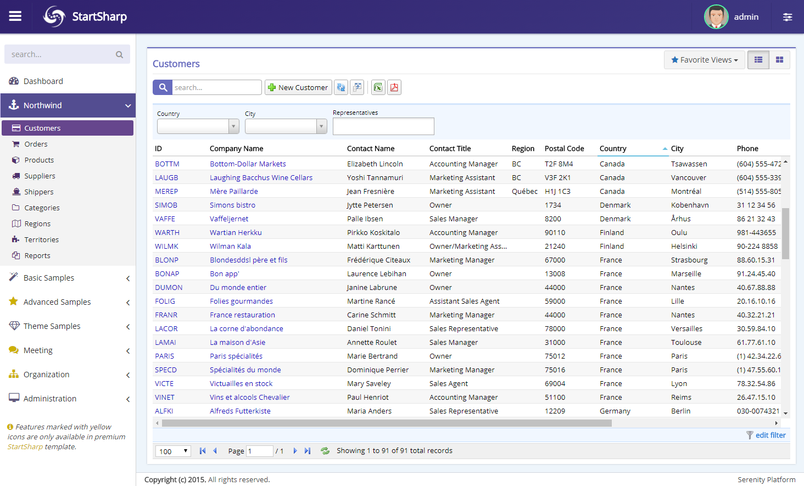

### Glassy (translucent theme with background)

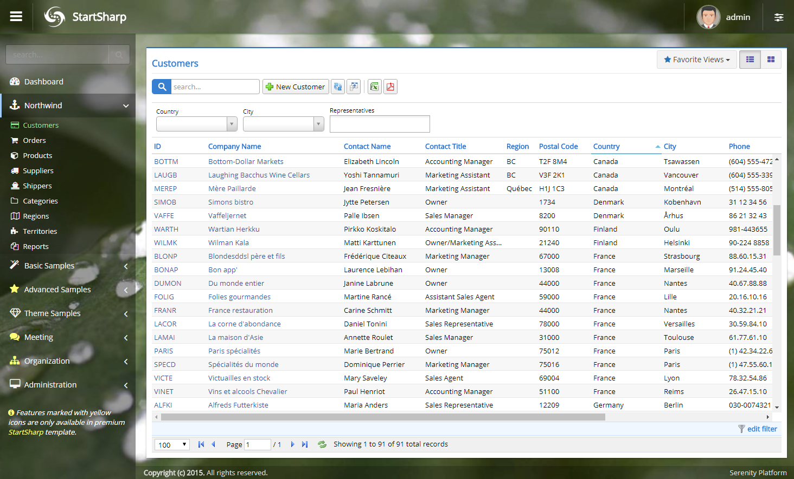

### Glassy Light

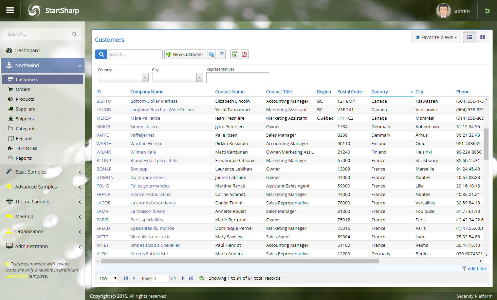


## Step by Step Wizard

This is a wizard component that lets you easily create a step by step interfaces, for example to create an order.

Wizard allows you to choose an existing customer or create a new one on the fly.

This sample is based on our WizardDialog premium widget, which simply uses Tab attributes defined on a Form class, to auto create steps.

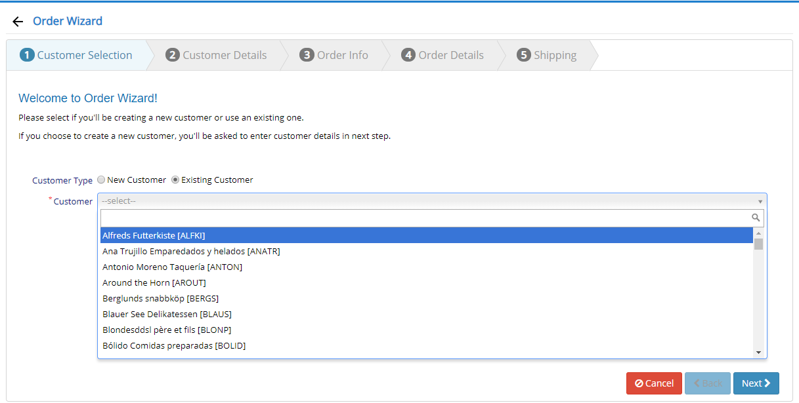

It is pretty easy to apply validation between steps, skip some steps based on user selection, or add dynamic intermediate steps when required.

## Card View

Card view allows you to show records as fully customizable cards, and easily switch between Card / List views.

> thanks a lot to Brainweber Inc. for sponsoring this feature and letting us share it with community


This feature is implemented as a Mixin that you can simply apply to any of your grids (EntityGrid / DataGrid).

We used *React* for card templates, so you can simply customize it to your needs and use any property available in your rows.

**CustomerGrid.ts:**

```ts
    var editItem = this.editItem.bind(this);

    new Serenity.CardViewMixin({
        grid: this,
        renderItem: (item, index) => React.createElement(CustomerCard, {
            item: item,
            editItem: editItem
        })
    });
```


**CustomerCard.tsx:**

```tsx
    export class CustomerCard extends React.Component<CustomerCardProps> {
        render(): React.ReactNode {
            var item = this.props.item;
            return (
                <table>
                    <tbody>
                        <tr>
                            <td rowSpan={4} className="img">
                                
                            </td>
                        </tr>
                        <tr>
                            <td className="name">
                                <a href="javascript:;" onClick={e => 
                                this.props.editItem(item)}>
                                    {item.CustomerID} - {item.CompanyName}
                                </a>
                            </td>
                        </tr>
                        <tr>
                            <td className="contact">{item.ContactName}, 
                            {item.ContactTitle}</td>
                        </tr>
                        <tr>
                            <td className="country">{item.City}, {item.Country}</td>
                        </tr>
                    </tbody>
                </table>
            );
        }
    }
}
```

## Favorite Views

Serenity supports persisting grid settings like visible columns, widths, sort orders. It remembers the latest settings and restores them next time you enter that page. 

Sometimes you might want to save a view and restore it at a later time. This is also useful for dynamic reporting / data export purposes.


This is also implemeted as a grid mixin so it can be easily applied to any grid. As a bonus, it is also compatible with card view feature, so it remembers if grid is in card/list view mode and restores that state.

## Excel Style Filtering

HeaderFiltersMixin lets you easily use Excel style column filtering on any of your grids. 

Just click on a filter icon next to column headers and distinct column values are fetched from server side, so it displays all values even when data is paged.

This feature also works on in-memory grids unlike quick filters.


## Drag & Drop Grouping

Draggable grouping mixin allows you to group by any column by dragging its header into the target (blue) area.

You may also set which columns should be grouped initially by adding [GroupOrder] attributes to them in your Columns.cs

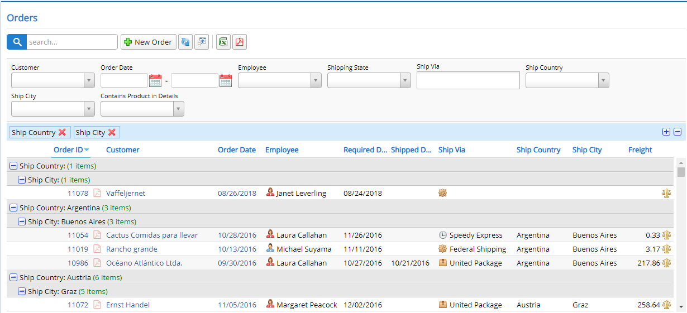

## Customizable Summaries

CustomSummaryMixin lets user to click on a column footer and change summary type to Avg, Min, Max or Sum.

Default summary type is determined by column data type and can be changed by adding a [SummaryType] attribute to the related property in Columns.cs

Summary customization also works along with draggable grouping mixin, so group based aggregates are also available.

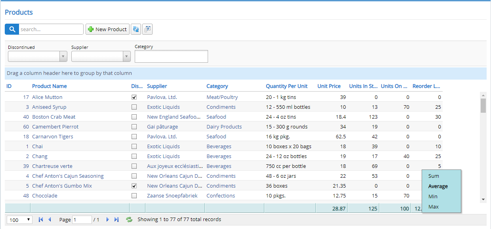


## Email Client Sample

StartSharp comes with a full-featured IMAP based e-mail client written with React. It can connect to any e-mail account supporting IMAP protocol, like Gmail, Hotmail, Yandex, Yahoo in addition to your local mail server.

We use MailKit for connecting to servers.

Here is some screenshots from the new sample:

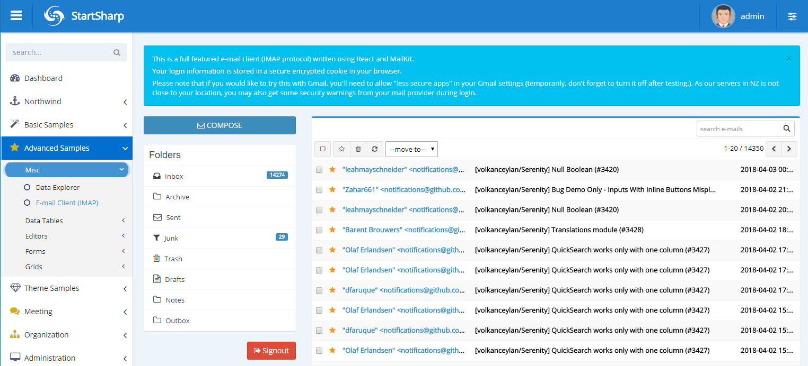


## Data Explorer

This is a table explorer, similar to view data in SQL Management Studio.

Its main purpose is to demonstrate how you could manage to work with dynamic data sources and columns in Serenity, without having to generate code with Sergen for them.


## Data Audit Log

StartSharp provides a zero configuration data logging system that allows auditing changes made to an entity by simply adding a [DataAuditLog] attribute. Make any change to such an entity and you'll see that its details are logged in the data audit log table without writing a single line of code:

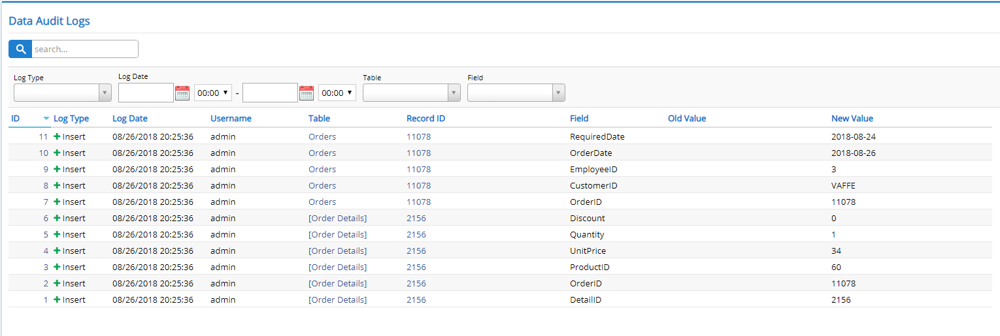

## Product Picker Dialog

Even though Select2 allows you to select single or multiple items easily, sometimes you might want to open a dialog and let user to pick items there by marking checkboxes.


> Thanks a lot to Bob Munn for sponsoring this feature and letting us to share it with community. And please get well soon...

## Split Master Detail

Demonstrates how to implement a split view for master detail grids. Click on a customer row on top grid to view / modify its orders. Split.js library is used for panes.


## Background Task System

You might want to run some process periodically, e.g. daily, or every three hours. 

Even though you could use Scheduled Tasks in Windows, this would require manual configuring such tasks in every server you install your application. 

Windows service is another option but comes with its own set of problems like being hard to manage, code duplication etc.

StartSharp includes a background task system for your web applications. Even though it is not as feature filled as some other choices like HangFire (https://www.hangfire.io/), it gets the job done without having to learn too much.

```cs
namespace StartSharp.Common.Services
{
    using Entities;
    using Serenity;
    using Serenity.Data;
    using System;

    public class MailingBackgroundTask : PeriodicBackgroundTask
    {
        protected override TimeSpan GetInterval()
        {
            var config = Config.Get<MailingServiceSettings>();
            return TimeSpan.FromSeconds(config.Interval);
        }

        protected override void InternalRun()
        {
            var env = Config.Get<EnvironmentSettings>();
            var config = Config.Get<MailingServiceSettings>();

            if (!config.Enabled)
                return;

            using (var connection = SqlConnections.NewFor<MailRow>())
            {
                var m = MailRow.Fields;

                var mailList = connection.List<MailRow>(q => q
                    .Take(config.BatchSize)
                    .Select(m.MailId)
                    //...
```

We implemented our next feature, Background Mail Queue on this task system.


## Background Mail Queue

Sometimes you might want to sent lots of e-mails, like bulletins. Sending thousands of e-mails might take considerable amount time, and the user, who tries to publish these e-mails, might get timeouts or have to wait a long long time.

Even though you need to send one or two e-mails, if your SMTP server is having problems, your users might get application errors.

Our mail queue lets you to send e-mails in background, retry sending in case of an error and see status of every individual message in a reporting page.

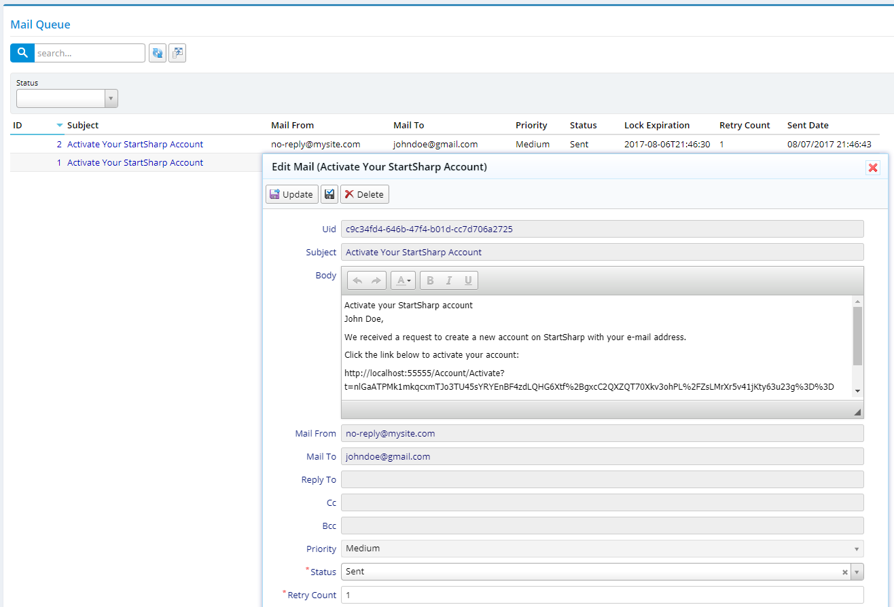

## Background Task to Generate PDF Reports

This is a sample background task that runs Order Detail Report every night at 01:30, generates its PDF, attaches it to an e-mail and sends it.

```cs
    public class OrderDetailSampleTask : DailyBackgroundTask
    {
        protected override TimeSpan GetRunAtTime()
        {
            // this task will run at 01:30 everyday
            return new TimeSpan(01, 30, 00);
        }

        protected override void InternalRun()
        {
            using (var connection = SqlConnections.NewFor<OrderRow>())
        //...
```

## Meeting Module

StartSharp comes with a full featured meeting management system module, which you can use as is, or take as a sample to develop your own customized version.


## Organization and Contacts Module

All businesses has some kind of hierarchical organization structure. Also most applications requires internal (e.g. users) and external contacts that might not be an actual user of the application.

StartSharp comes with a basic organizaton tree and contacts system that you can build and customize your application on.

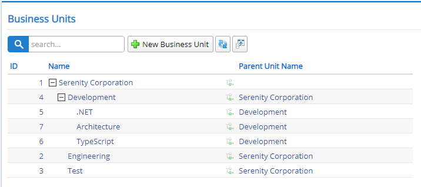


## Editors with Inline Actions

One of our premium customers asked us how to add inline action buttons next to editors. Instead of helping him in private, we choose to add this sample to *StartSharp*, so that other members can make use of it. 

> Many samples in *StartSharp* are implemented based on customer requests and feedback.


## Multi Dates Picker Widget

This is a sample of how you could integrate third party controls and create your own Serenity widgets when needed. It allows you to select multiple dates by making use of the functionality provided by an external javascript module.

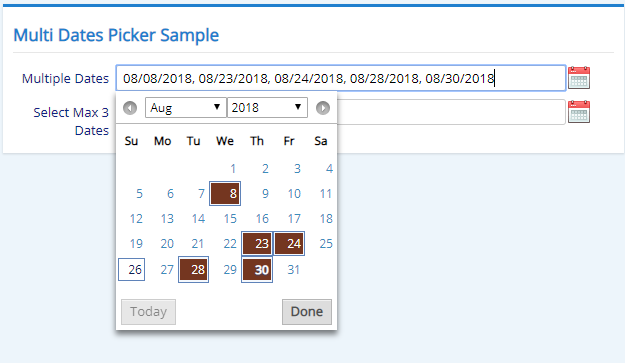

## Data Tables Integration

Serenity uses *SlickGrid* under the hood for your listing pages. It is possible to use another grid / table component for some pages if required.

In this sample we demonstrate how you could integrate popular DataTables plugin, in both client side / server side data source mode, while still making use of Serenity services.

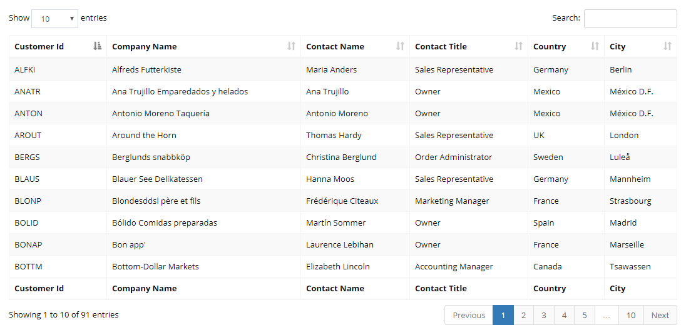

## Bootstrap Table / Form

Sergen generates a standardized listing / editing interface and services for your tables, with minimal code possible.

In some cases, you might want to use good old methods like a pure Bootstrap table / form with basic HTTP POST and no AJAX / web services.


This sample is implemented in a way very similar to Entity Framework tutorial you can find on MSDN, whilst using Bootstrap instead of raw HTML tables / forms and Serenity data layer instead of EF.


## Long Running Action with Progress

Even though *Cancellable Bulk Action* sample in Serene is fine for work that you can split into chunks, sometimes you may want to handle a long running operation in one transaction / request.

This sample demonstrates how we could execute a task at server side, possibly in a background thread, return immediately from service action, while still reporting status / progress and allowing user to cancel it if possible.


## Roadmap

We're regularly adding new features to StartSharp. If you would like to see what we are cooking next in our software kitchen, you may take a look at our roadmap:

https://github.com/volkanceylan/Serenity/projects/1

## Conclusion

Our StartSharp packages contain valuable extra modules, features, samples and also come with premium support.

By purchasing one of these packages, we aim to help you save your most precious resource, *time*, while granting you access to additional content.

Also as a bonus you'll be driving us to add more features to StartSharp and help Serenity move forward.

So we hope that your investment will be for a win-win. Thanks for your time and support.